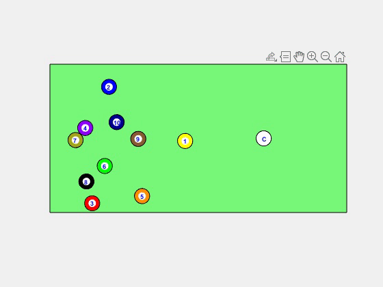

# ME212 Project | Pool Ball Collisions

The project was completed in the Spring of 2021 for University of Waterloo
course ME212-Dynamics. This project was completed jointly by Austin W. Milne
and Alex Roman.

The intent of this project is to test our understanding of the physics around
collisions. This includes conservation of momentum, coefficient of restitution,
friction during collisions, and general kinetic friction.

The matlab code created is heavily commented and should be easy enough to follow.

The LaTeX report is generated using some of the outputs of the MatLab script, So
generating the report would require running matlab script first.

Below is an example gif of the output video, demonstrating the overall goal:

_LaTeX report signed with Austin Milne's GPG key: 6E8329BB07B245820C91E88B409B6A5A30BE7AAD_